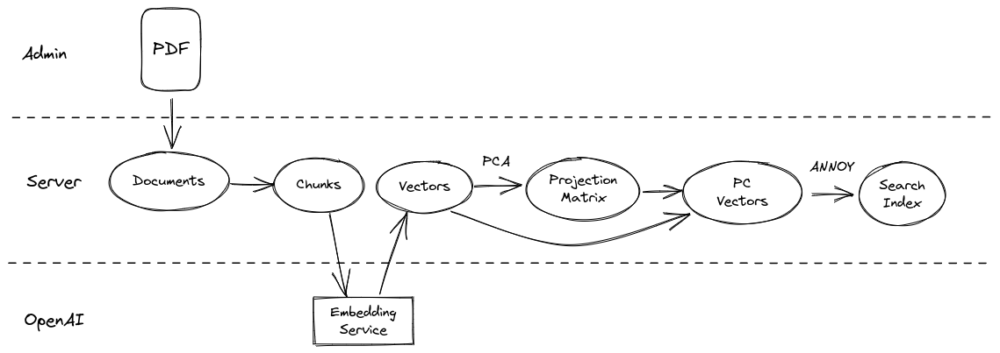
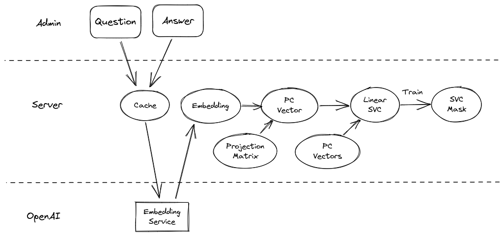
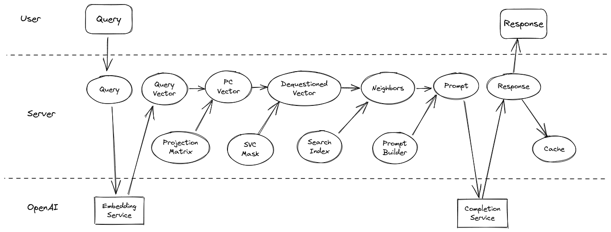
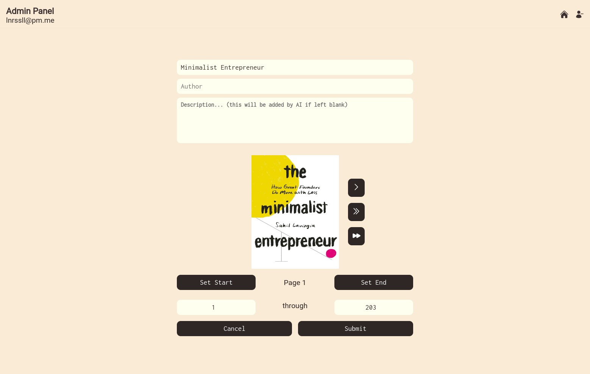

# Ask My Book

Ruby on Rails application that accepts a PDF eBook, parses and vectorizes its content, then offers context-aware, ChatGPT-powered Q&A

## Notes

Deployed to AWS: [here](http://44.234.84.19) (no SSL or DNS, just an HTTP to the IP)

You'll need an access code (from me) to sign up there, because my OpenAI API key is used for all the API requests, and I of course don't want anyone using that...

However, this repo can be used to self-host with your own OpenAI API key.

* Ruby version
    * 3.2.2

* System dependencies
    * openBLAS for Numo::Linalg (requires gfortran)
        * on linux: `sudo apt install gfortran`
        * on Mac: `brew install gfortran`

* Configuration
    * requires OPENAI_API_KEY environment variable

* Database creation
    * rails db:create

* Deployment instructions
    * Deploy EC2 (ideally over 16GB of storage, multiple cores) instance with Nginx and Docker installed
    * set up Nginx proxy from default port 80 to port 3000 (and you'll need to set `client_max_body_size 10m;` and `proxy_read_timeout 1000s` in your nginx.conf)
    * clone the repo and cd into it
    * set ENV variables (explained below)
    * start the server with `docker-compose build && docker-compose up` (docker-compose.yml does most of the heavy lifting here)

## Architecture

### React on Rails

I elected to use Shakapacker's [React on Rails](https://github.com/shakacode/react_on_rails), because I am most comfortable with React for client side programming/UX, and it is very easy to configure with Typescript. To be honest, I chose it over other good Rails + React alternatives because I inspected the Gumroad website to figure out what they use in production. I do think it's a great pick though: the integration with Redux and ease of use with React Router is fantastic in my opinion.

I didn't adhere precisely to the original project, on both the client and server side. My methodology for computing neighbors is very different, and, in order to give users fine-grained control over the parameters I use on the server, it felt necessary to really deep dive into the process in an admin panel. I also don't want just anybody using my OpenAI credits in deployment, so I added user auth to *both* the admin panel and the regular user interface. The user interface also has one additional layer: a menu for books. This is because I wanted to demonstrate the application's ability to work across many books. After selecting a book, you are brought to a familiar page, akin to the [askmybook.com](askmybook.com) homepage.

Since this project was built in 4 days, the admin panel currently has basically zero styling beyond what is minimally needed for functionality (and my own perfectionism/OCD). I primarily wanted my UX features (but not necessarily *style*) and architecture to speak for the project, because I know Gumroad already has its own library of styles. For proof that I can actually implement styles, check out [this website](https://edcred.vercel.app) with next/react/redux, which follows an existing style formula, or [this client-only website](https://edbed.net) with react, which I designed from scratch (with some pixel art assets created by a friend). These websites are both incomplete/stealth with respect to content and prod readiness, but they are usable for demonstration purposes.

### Approximate Nearest Neighbors

Rather than calculating the dot product (equivalent to cosine similarity for normalized vectors, which the Ada embeddings are) of the query vector against every vector in the (potentially very large) dataset, it is more performant (at production scale, at least) to approximate the nearest neighbor search. One popular such method is by binary tree search via the method of random hyperplane projections. This is basically a higher-dimensional analogue to binary search, in which the vector space is recursively subdivided into two subspaces. I'm most familiar with [ANNOY](https://github.com/spotify/annoy), Spotify's open source implementation by [Erik Bernhardsson](https://erikbern.com/), which fortunately has [Ruby bindings](https://github.com/yoshoku/annoy-rb). This library saves compute at runtime by indexing a forest of random projection trees and traversing each one simultaneously with multiple processes to find neighbors.

However, ANNOY is designed to work best in hundreds of dimensions, not thousands.

### Dimensionality Reduction

Ada model embeddings are returned as normalized 1536-dimensional vectors, but those embeddings are designed to capture information that uniquely classifies inputs across the entire OpenAI training corpus (which is huge). For a single document (book), far fewer dimensions are needed to capture most (or all) of the variance across dataset elements. First, any set of m datapoints in an n-dimensional space, with `m <= n`, can be losslessly projected onto an `(m - 1)`-dimensional subspace (for an example of this lossless projection, consider 3 points in 3D space: there can only be variation along two axis because they always lie on the same 2D plane in 3D). That is to say, only the top m singular values of the dataset matrix are nonzero (subspace plus distance to origin). Second, for a document on a single topic and by a single writer, m may actually exceed to optimal number of dimensions represented in the dataset. I perform Singular Value Decomposition (SVD) to identify (1) the contribution of each dimension to variation in the dataset and (2) the transformation from the standard basis vectors to those axes (also called PCA).

Because the singular values also represent the contribution to total variance along their representative axis, we can basically softmax the diagonal of S and sum/accumulate along it until we reach the desired percentage of the original variance we wish to preserve. By default, I set this to 90%, but it can be set in the admin panel. Ideally, I would interpolate a plot of the softmaxed diagonal (a scree plot) and estimate a second derivative to identify the inflextion point where diminishing marginal returns become increasingly small, which typically exists in my experience with ada embeddings (because the matrices are low rank, the scree plots decay ~exponentially then inflect into more rapid decay to zero).

Reduced dimensionality increases distance calculation speed in inverse proportion to the reduction, and for approximate nearest neighbors search by random hyperplane projection trees, it reduces the number of trees needed for the same search logarithmically.

When new embeddings are created, they are matrix multiplied with the same projection matrix prior to any analysis.

### Dequestionification (Vector Debiasing)

One of the principal concerns I have with the direct similarity approach to vector search for queriable documents is that the characteristics of the query itself are not orthogonal to the dataset: questions may be more similar to (unrelated) questions than they are to (related) answers. What you want to perform a comparison search is actually something that looks like an answer to the input query. To solve this, I collect a list of questions about the book, then train a Linear Support Vector Classifier (SVC) to find the hyperplane along which my sample questions are maximally separable from the rest of my dataset. Before performing a similarity search on user inputs, I remove the most relevant components of the SVC coefficients/weights from the query vector (after dimensionality reduction). This significantly improves querying performance in my testing, at least in qualitative terms, with a constant time complexity cost (mostly loading the weights into memory).

### Natural Language Question-Answering

To actually generate answers to the user queries, I've elected to use the OpenAI ChatCompletions endpoint. The gpt-3.5-turbo model is 10x cheaper than the davinci InstructGPT model and optimized for dialogue (which this fundamentally is). With ChatCompletions, there is no few-shot "prompt-engineering" (examples) required to get useful responses, because the context can be provided directly in the "system message," and much of the few-shot example heavy-lifting is taken care of during model training via RLHF. This saves valuable context space for tokens that give the model more task-specific material to work with (from the vector search).

I specifically instruct the model to only use the provided source material in its responses and to use optionally use direct citations. This helps prevent hallucinations (for popularly known books that it knows about), while still providing users with useful references for their own further research. To keep the responses concise, I also prompt the model to use at most one of the source material passages, and I use the newline character as a stop token parameter to the model, explicitly preventing it from using more than one paragraph.

As a consequence of this (I argue, necessary,) constraint, only one passage is ever needed at most. While this *would* help to limit the context token usage (and thus, cost), it eliminates perhaps the most useful search layer: GPT-3.5-turbo's attention. Cohere recently released a search endpoint called "rerank" which basically uses an LLM to rerank search results directly. While the actual process is not (to my knowledge) fully disclosed, it looks like they're using either a cross-encoder (see the [Weaviate blog](https://weaviate.io/blog/cross-encoders-as-reranker)) or a causal language model (leveraging its emergent reasoning capabilities) to directly assess relevance against the query, bidirectionally. Implicitly, this is what we're doing in a single step during the actual prompting: letting the LLM decide which of my k-nearest-neighbors are actually the most relevant search results. Thus, it's worthwhile to at least use more context passages than you intent to cite and potentially to max out the context window (4,057 tokens, in the case of GPT-3.5).

Finally, I use the system message to present the prompt and source content, because the model is also trained to adhere more closely to its prompts than the user's. I pass the source material from the vector search as a stringified JSON, because the GPT models are pretrained primarily on code (for logical reasoning development), so they have a deep understanding of structured data. The user query is passed as a "user" message, and the "assistant" just reponds directly.

### Further Improvements

Rather than caching plaintext queries that have already been answered, which only works if two users ask the *exact* same question verbatim, an obvious improvement would be to use a similarity threshold to identify similar cached questions. Of course, you don't want to answer *the wrong* similar question or recite an answer whose grammatical formulation doesn't match the question (initial query: "Is it raining today?"; matched query: "Is it not raining today?"; cached answer: "yes"). To solve this, while still saving API usage costs, similar but-not-identical queries could be answered without any vector-matched context, using only the cached question and answer as context. Similar questions should have similar answers, or at least use similar context compression. Based on my own experimentation, this should be pretty successful with a 0.95 threshold for similarity.

## How To Use

### Normal user

When you go to the home URL, you will see a list of books that have been "published" to the site. If you click on this (or the "user+" icon), you will be redirected to the login screen.

Choose to sign up, and use your access code to create an account, then use that account to log in.

Now, you will be able to click on one of the published books and ask it questions (every account defaults to have $10 of openai credits)

To logout or deactivate, just click the "user-" icon in the bottom right corner.

### Admin

After logging in, you'll see a "toolkit" icon in the bottom left corner of the screen. Click this to enter the admin panel.

Here, you'll see an option to upload a document. You can click on this, select a file, and a preview will be rendered on-screen. Use this preview and the page navigation tools to select the start- and end-pages of your document for the embedding (e.g. skip table of contents, glossary  etc.). The title will be generated from the file name, but you'll have to fill out the author manually. The description will be generated automatically by the AI after preprocessing as an answer to the question "What is #{book.title} about?".

After uploading completes, you'll see a series of build steps. They may take a while, but sit tight: they'll only take a few minutes for any normal-length book. The slowest part is the embeddings API calling, by far. (with more time, I'd implement my own with an E5 backend, saving a lot of time/money with basically no performance hit but with the caveat that it requires a GPU)

Once you've completed all the pre-processing steps, you'll want to add some questions by clicking on the "questions" button. Once you've added (let's say 10) questions, you can "embed" them, then "classify" (train the linear SVC).

You can also test the vector search on the "Test" page

Once you've created your classification, click "Go Live", and the Book will appear for all users (including you) when you go back to the normal view (the "home" icon)

At any time, you can navigate back to the main admin menu by clicking on the words "Admin Panel" in the top left.

### Known Issues

There is a small CSRF token bug that requires you to refresh the page after signing out in order to sign back in.

## Deployment

Though I was hoping to deploy with Heroku (common for these types of Ruby apps), the OpenBLAS dependency for my linear algebra library meant that Heroku one-click deployment heaven was out of reach. So I decided to dockerize the project and deploy it to AWS instead. This should also make it much easier to run my code on your own machine, as an added bonus. Unfortunately, latest rails has several [issues](https://github.com/rails/rails/issues/32947) with docker deployments, so I had to update to edge rails (7.1) after a nice, long debugging deep dive. Nonetheless, here we are!

### ENV variables

RAILS_ENV=production

POSTGRES_HOST=db

POSTGRES_DB=ask_my_book_production

POSTGRES_USERNAME=askmybook

POSTGRES_PASSWORD=[your password]

RAILS_MASTER_KEY=[your master key, in config/master.key]

SALT=[some secret]

OPENAI_API_KEY=[your api key, starts with sk-]

for secret generation (db password and salt), I'd suggest: `openssl rand -base64 16 | tr -dc 'a-zA-Z0-9' | xclip -selection clipboard`
